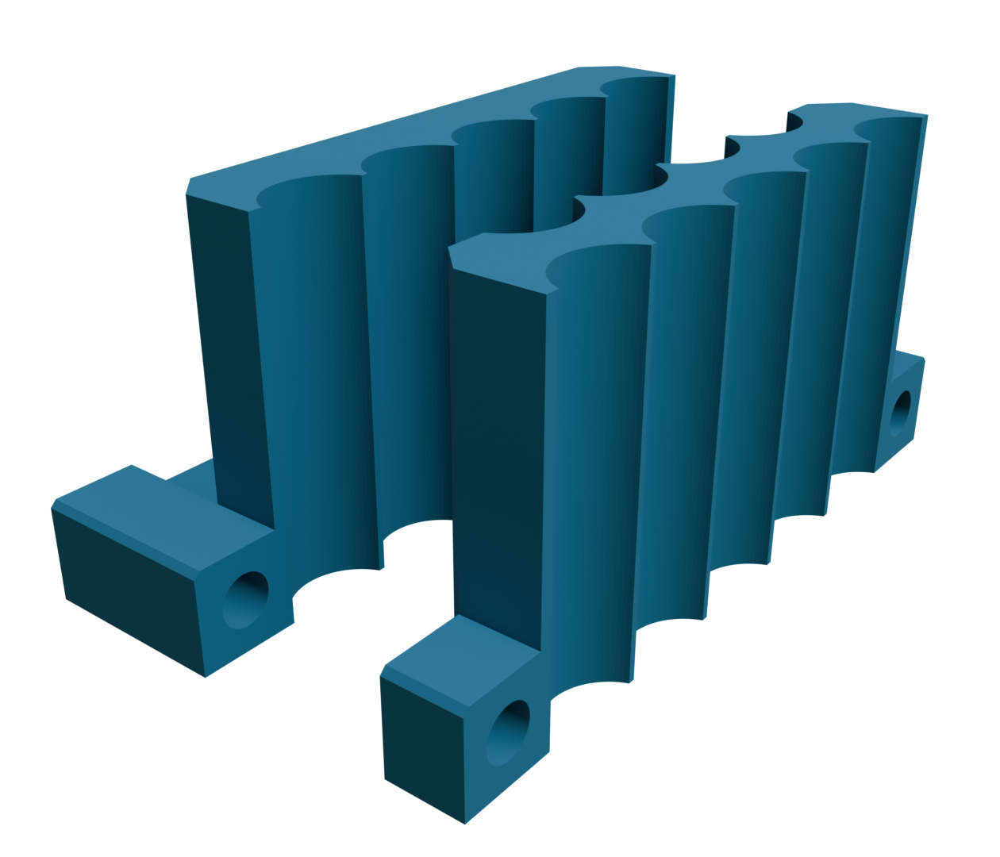

# Spot weld helper
This OpenSCAD script generates a simple spot weld helper for battery cells.
Depending on the desired number of cells and their dimensions it creates
two matching holder objects.

One base object has cut-outs for the number of cells whereas the second 
object (slider) has two cut-outs on both sides. The second row is designed
for one less cell so that battery packs with tightly packed cell can be
easily created.

Both objects can have embedded magnets to hold the cells in place. They
can either be embedded in the print or inserted into proper slots from
the bottom.

The script includes variables for the OpenSCAD customizer to easily adapt
it to different needs. A description of all variables is given below.

# Customization
The script uses the customizer functions provided by OpenSCAD. There are 
four groups of settings that can be adjusted.

## Cells
- **Number of cells** \
  Define the maximum number of cells in a row.
- **Cell diameter** \
  Nominal diameter of each cell in millimeters.
- **Cell height** \
  Nominal cell height. Used to calculate the object height (cell height
  minus 5 mm).
- **Cell spacing** \
  Distance between the cell you want to use (Cell diameter plus
  0.2 mm usually works fine)

## Magnets
- **Use magnets** \
  Allows you to disable all magnet insert pockets.
- **Integrate magnets** \
  Generates either open pockets or embedded pockets that require you
  to pause your print and insert the magnets. If your mangets have
  different heights you might needs two pauses when printing both
  objects at the same time.
- **Magnet 1 width, height, depth** \
  The dimensions of the first magnet. Pockets will add a tolerance
  to these values.
- **Manget 2 width, height, depth** \
  Magnet dimensions for the second object. Since this one has two rows
  of cell holders the magnets are placed in closer distance and need 
  to be smaller.

## General dimensions
- **Use axis guides** \
  Creates the axis guides in both objects so that the second one can
  be easily moves in parallel to the first one.
- **Axis diameter** \
  Diameter of the axes to be used, in millimeter.
- **Base width** \
  Dimension for the support width on the first part, in millimeters.

## Tolerances
- **Tol** \
  Tolerance used for most cutouts (axes, magnets)
- **Extrusion width** \
  On some features with thin walls the minimum wall thickness can be
  set to multiples of extrusion width. This is to ensure your slicer
  can properly slice the objects.
- **Min wall lines** \
  This sets the mimimum wall thickness in multiples of extrustion width
  for thin walls, e.g. between the magnet and battery cell and the "tip"
  between the cell cutouts.
- **Bevel large** \
  Both objects are beveled at certain edges. This is the bevel size in
  millimeters.

